# Design Hub

The design hub is a website geared towards artists who want to find other artists to collaborate with. Artists can create a profile and choose which styles and mediums they like to work in, as well as upload samples of their work to an online portfolio. In turn they can also view other artists’ work to see if their styles are compatible. 

## UX

### Colour Scheme

I used #F8F4E3 (Cosmic Latte) as my background colour, #40434E (Charcoal) for the header and #F77F00 (Orange – Wheel) for my icons. I used [coolors.co](https://coolors.co/palette/f8f4e3-f77f00-40434e)to generate my colour palette.

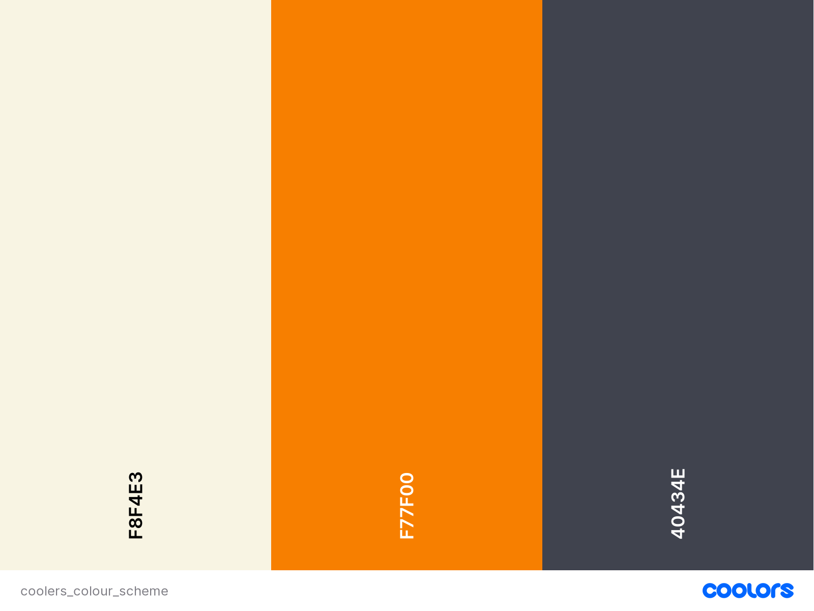

### Typography

- [Open Sans]( https://fonts.google.com/specimen/Open+Sans) from Google Fonts were used for the site.
- [Font Awesome](https://fontawesome.com) icons were used throughout the site such as links in the navigation bar and edit/delete functionalities.

## User Stories

- As a site user, I can create an account so that other artists can find and contact me.
- As a site user, I can read other artists' profiles so that I can find someone to work with on projects.
- As a site user, I can edit my profile so that I can alter my interests.
- As a site user, I can delete my profile so that other users can no longer find me.
- As a site user, I can search for other artists so that I can find someone with the same interests.
- As a site user, I can message other artists so that I can organise collaborations.
- As a site user, I can contact the design hub directly so that I can raise issues, comments, or questions.
- As a site user, I can add a piece of artwork so that other artists can see my style and medium.
- As a site user, I can edit a piece of artwork so that I can reach the best possible audience.
- As a site user, I can delete a piece of artwork so that I can customise my profile for maximum benefit.

## Wireframes

To follow best practice, wireframes were developed for mobile, tablet, and desktop sizes.
I've used [Balsamiq](https://balsamiq.com/wireframes) to design my site wireframes.

### Mobile Wireframes

#### Homepage/Artwork List Page

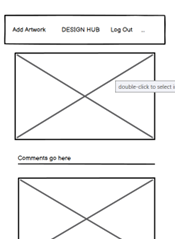

#### Add Artwork Page

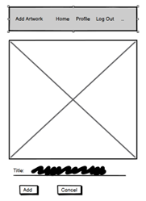

#### Edit Artwork Page

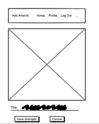

### Tablet Wireframes

#### Homepage/Artwork List Page

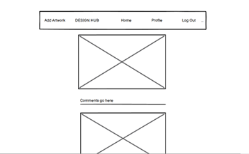

#### Add Artwork Page

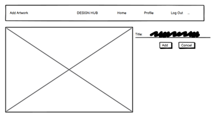

#### Edit Artwork Page

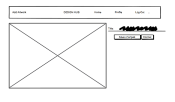

### Laptop Wireframes

#### Homepage/Artwork List Page

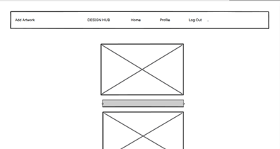

#### Add Artwork Page

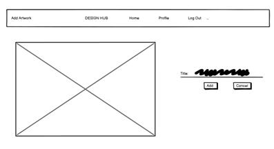

#### Edit Artwork Page

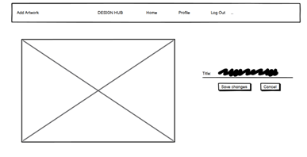

## Features

### Existing Features

### Future Features

There are a number of features which could be added to the Design Hub on future iterations. This could include:
-	The ability to comment on other’s artpieces
-	The ability to like artwork
-	The ability to follow artists
-	A messaging feature
-	A feed with suggested artists
-	An expanded search feature
-	A developed profile section where an artist can show a full portfolio of their work

## Tools & Technologies Used

- [HTML](https://en.wikipedia.org/wiki/HTML) used for the main site content.
- [CSS](https://en.wikipedia.org/wiki/CSS) used for the main site design and layout.
- [CSS Flexbox](https://www.w3schools.com/css/css3_flexbox.asp) used for an enhanced responsive layout.
- [JavaScript](https://www.javascript.com) used for user interaction on the site.
- [Python](https://www.python.org) used as the back-end programming language.
- [Git](https://git-scm.com) used for version control. (`git add`, `git commit`, `git push`)
- [GitHub](https://github.com) used for secure online code storage.
- [GitHub Pages](https://pages.github.com) used for hosting the deployed front-end site.
- [Gitpod](https://gitpod.io) used as a cloud-based IDE for development.
- [React Bootstrap](https://getbootstrap.com) used as the front-end CSS framework for modern responsiveness and pre-built components.
- [Django](https://www.djangoproject.com) used as the Python framework for the site.
- [Django-allauth](https://django-allauth.readthedocs.io/en/latest/) used to provide registration functionality.
- [PostgreSQL](https://www.postgresql.org) used as the relational database management.
- [ElephantSQL](https://www.elephantsql.com) used as the Postgres database.
- [Heroku](https://www.heroku.com) used for hosting the deployed back-end site.
- [Cloudinary](https://cloudinary.com) used for online static file storage.
- [Whitenoise](https://whitenoise.readthedocs.io/en/latest/django.html) used for serving static files.
- [Django Filters](https://django-filter.readthedocs.io/en/stable/)- used for adding search functionality to serializers
- [Pillow](https://pypi.org/project/Pillow/) used for adding image processing capabilities

## Database Design

Entity Relationship Diagrams (ERD) help to visualize database architecture before creating models. I used [draw.io](https://app.diagrams.net/) to create my ERD.

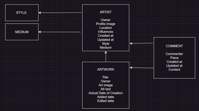

## Reuseable Components

There are a number of reusable React components within the project:

### Navbar: 

The Navbar component is used across all pages. When a user is not logged in, it provides sign in/sign up options. For logged in users, it provides the link to upload a piece of artwork and sign out of the site. Future iterations of the project will expand on this functionality: there will be links to a user’s profile page/account, their feed/suggested artists, as well as a chat/messaging feature.

### Artwork Asset:

The artwork asset is used on the homepage to display the art images. It is also used within the results of the search function to display a spinner. This feature could be used within an expanded search feature to search through user profiles and comments. In future iterations, this feature could be expanded to include searching by location, keyword tags, art styles, art mediums, and key words within a chat/messaging feature.

### EditDeleteDropdown:

This component has been used to enable a logged in user to edit or delete their art image. This component could be expanded to include further options (for owners and non owners) of the images such as share to external social media sites, save to a ‘favourites’ folder or moderate privacy settings (e.g. make a particular art image visible or invisible to selected other site users). The component could also be applied to a comment or messaging feature. 

## Agile Development Process

### GitHub Projects

[GitHub Projects](https://github.com/brindle5/design_hub/projects) served as an Agile tool for this project. I tracked my user stories using the basic Kanban board.

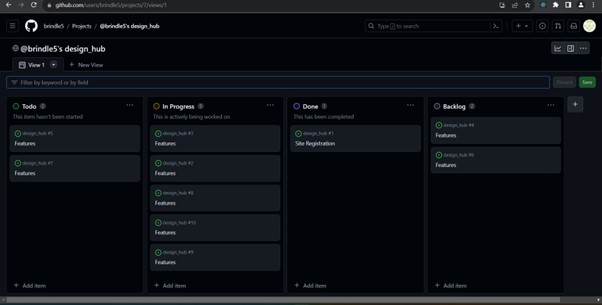

### GitHub Issues

[GitHub Issues](https://github.com/brindle5/design_hub/issues) served as an another Agile tool.
There, I used my own **User Story Template** to manage user stories. It also helped with milestone iterations on a weekly basis.

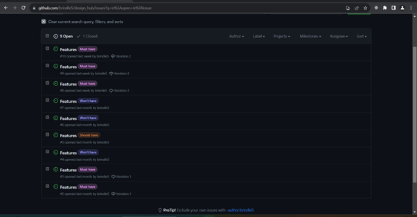

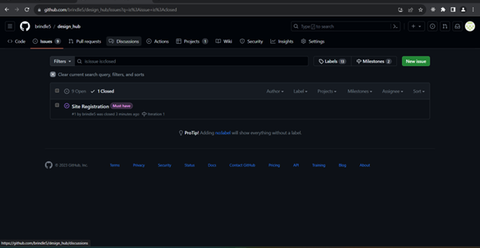

### MoSCoW Prioritization

I applied MoSCow prioritization and labels to my user stories within the Issues tab.

**Must Have**: guaranteed to be delivered 

- As a site user, I can create an account so that other artists can find and contact me.
- As a site user, I can read other artists' profiles so that I can find someone to work with on projects.
- As a site user, I can edit my profile so that I can alter my interests.
- As a site user, I can add a piece of artwork so that other artists can see my style and medium.
- As a site user, I can edit a piece of artwork so that I can reach the best possible audience.
- As a site user, I can delete a piece of artwork so that I can customise my profile for maximum benefit.

**Should Have**: adds significant value, but not vital 

There were no user stories placed in this category.

**Could Have**: has small impact if left out 

- As a site user, I can search for other artists so that I can find someone with the same interests.

**Won't Have**: not a priority for this iteration

- As a site user, I can delete my profile so that other users can no longer find me.
- As a site user, I can message other artists so that I can organise collaborations.
- As a site user, I can contact the design hub directly so that I can raise issues, comments, or questions.

## Testing

For all testing, please refer to the [TESTING.md](TESTING.md) file.

## Deployment

The live deployed application can be found deployed on [Heroku](https://design-hub-af7f99885c3f.herokuapp.com).

### ElephantSQL Database

This project uses [ElephantSQL](https://www.elephantsql.com) for the PostgreSQL Database.

To obtain your own Postgres Database, sign-up with your GitHub account, then follow these steps:
- Click **Create New Instance** to start a new database.
- Provide a name (this is commonly the name of the project: design_hub).
- Select the **Tiny Turtle (Free)** plan.
- You can leave the **Tags** blank.
- Select the **Region** and **Data Center** closest to you.
- Once created, click on the new database name, where you can view the database URL and Password.

### Heroku Deployment

This project uses [Heroku](https://www.heroku.com), a platform as a service (PaaS) that enables developers to build, run, and operate applications entirely in the cloud.

Deployment steps are as follows, after account setup:

- Select **New** in the top-right corner of your Heroku Dashboard, and select **Create new app** from the dropdown menu.
- Your app name must be unique, and then choose a region closest to you (EU or USA), and finally, select **Create App**.
- From the new app **Settings**, click **Reveal Config Vars**, and set your environment variables.

| Key | Value |
| --- | --- |
| `DATABASE_URL` | user's own value |
| `CLOUDINARY_URL ` | user's own value |
| `ALLOWED_HOST` | user's own value |
| `SECRET_KEY` | user's own value |
| `CLIENT_ORIGIN` | user's own value |
| `DISABLE_COLLECTSTATIC` | 1 (*this is temporary, and can be removed for the final deployment*) |

Heroku needs three additional files in order to deploy properly.
- requirements.txt
- Procfile
- runtime.txt

You can install this project's **requirements** (where applicable) using:
- `pip3 install -r requirements.txt`

If you have your own packages that have been installed, then the requirements file needs updated using:
- `pip3 freeze --local > requirements.txt`

The **Procfile** can be created with the following command:
- `echo web: gunicorn app_name.wsgi > Procfile`
- *replace **app_name** with the name of your primary Django app name; the folder where settings.py is located*

Heroku needs runtime.txt to know what version of Python to use and for that, use the line:
- `python-3.9.16`

For Heroku deployment, follow these steps to connect your own GitHub repository to the newly created app:

Either:
- Select **Automatic Deployment** from the Heroku app.

Or:
- In the Terminal/CLI, connect to Heroku using this command: `heroku login -i`
- Set the remote for Heroku: `heroku git:remote -a app_name` (replace *app_name* with your app name)
- After performing the standard Git `add`, `commit`, and `push` to GitHub, you can now type:
	- `git push heroku main`

The project should now be connected and deployed to Heroku!

#### Cloning

You can clone the repository by following these steps:

1. Go to the [GitHub repository](https://github.com/brindle5/design_hub) 
2. Locate the Code button above the list of files and click it 
3. Select if you prefer to clone using HTTPS, SSH, or GitHub CLI and click the copy button to copy the URL to your clipboard
4. Open Git Bash or Terminal
5. Change the current working directory to the one where you want the cloned directory
6. In your IDE Terminal, type the following command to clone my repository:
	- `git clone https://github.com/brindle5/design_hub.git`
7. Press Enter to create your local clone.

Alternatively, if using Gitpod, you can click below to create your own workspace using this repository.

Please note that in order to directly open the project in Gitpod, you need to have the browser extension installed.
A tutorial on how to do that can be found [here](https://www.gitpod.io/docs/configure/user-settings/browser-extension).

#### Forking

By forking the GitHub Repository, we make a copy of the original repository on our GitHub account to view and/or make changes without affecting the original owner's repository.
You can fork this repository by using the following steps:

1. Log in to GitHub and locate the [GitHub Repository](https://github.com/brindle5/design_hub)
2. At the top of the Repository (not top of page) just above the "Settings" Button on the menu, locate the "Fork" Button.
3. Once clicked, you should now have a copy of the original repository in your own GitHub account!

### Local Deployment

This project can be cloned or forked in order to make a local copy on your own system.

For either method, you will need to install any applicable packages found within the *requirements.txt* file.
- `pip3 install -r requirements.txt`.

You will need to create a new file called `env.py` at the root-level,
and include the same environment variables listed above from the Heroku deployment steps.

Sample `env.py` file:

import os

- os.environ['CLOUDINARY_URL'] = 'user’s own value’
- os.environ['DATABASE_URL'] = 'user’s own value’
- os.environ['SECRET_KEY'] = 'user’s own value’
- os.environ['CLIENT_ORIGIN'] = 'user’s own value’
- os.environ['ALLOWED_HOST'] = 'user’s own value’

(Local evnironment only, do not run in a production environment):
- os.environ['DEBUG'] = '1'
- os.environ['DEV'] = '1'

Once the project is cloned or forked, in order to run it locally, you'll need to follow these steps:
- Start the Django app: `python3 manage.py runserver`
- Stop the app once it's loaded: `CTRL+C` or `⌘+C` (Mac)
- Make any necessary migrations: `python3 manage.py makemigrations`
- Migrate the data to the database: `python3 manage.py migrate`
- Create a superuser: `python3 manage.py createsuperuser`
- Load fixtures (if applicable): `python3 manage.py loaddata file-name.json` (repeat for each file)
- Everything should be ready now, so run the Django app again: `python3 manage.py runserver`

If you'd like to backup your database models, use the following command for each model you'd like to create a fixture for:
- `python3 manage.py dumpdata your-model > your-model.json`
- *repeat this action for each model you wish to backup*

### Local VS Deployment

I haven't found any differences in performance between the local and deployed sites.

## Credits

### Content

- Much of my code is based on the Code Institute [Moments](https://github.com/Code-Institute-Solutions/moments) and [Django REST](https://github.com/Code-Institute-Solutions/drf-api) walkthrough projects.
- I used Tim Nelson’s Markdown builder for the [readme and testing documentation](https://traveltimn.github.io/markdown-builder/).

### Media

### Acknowledgements

- I would like to thank my Code Institute mentor, [Julia Konovalova](https://github.com/IuliiaKonovalova) for her invaluable support and guidance.
- I would like to thank the [Code Institute](https://codeinstitute.net) tutor team for their assistance with troubleshooting and debugging some project issues.
- I’d like to thank my family and friends for supporting me through the challenges of this project.
