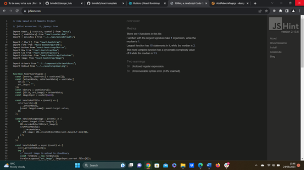

# Testing

Return back to the [README.md](README.md) file.

## Code Validation

### HTML

I have used the recommended [HTML W3C Validator](https://validator.w3.org) to validate all of my HTML files.

[Homepage](https://validator.w3.org/nu/?doc=https%3A%2F%2Fdesign-hub-af7f99885c3f.herokuapp.com%2F) | No errors 

Add Artwork Page | No errors

### CSS

I have used the recommended [CSS Jigsaw Validator](https://jigsaw.w3.org/css-validator) to validate  my [CSS file](https://jigsaw.w3.org/css-validator/validator?uri=https%3A%2F%2Fdesign-hub-af7f99885c3f.herokuapp.com) | Pass

### JavaScript

I have used the recommended [JShint Validator](https://jshint.com) to validate all of my JS files.

#### API

axiosDefaults.js | Pass

#### Components

ArtworkAsset.js | Few warnings

EditDeleteDropdown.js | Some warnings

NavBar.js | Few errors

#### Contexts

CurrentUserContext.js | Few warnings

#### Hooks

useClickOutsideToggle.js | Pass

#### Pages

##### Auth

SignUpPage.js | Few warnings

SignInPage.js | Few warnings

##### Artwork

ArtworkListPage.js | Few warnings

AddArtworkPage.js | Few warnings

EditArtworkPage.js | Few warnings

ArtPiecePage.js | Few warnings

### Python

I have used the recommended [PEP8 CI Python Linter](https://pep8ci.herokuapp.com) to validate all of my Python files.

#### Artists app

- [Models.py](https://pep8ci.herokuapp.com/https://raw.githubusercontent.com/brindle5/design_hub/main/artists/models.py) | No errors

- [Serializers.py](https://pep8ci.herokuapp.com/https://raw.githubusercontent.com/brindle5/design_hub/main/artists/serializers.py) | No errors

- [Urls.py](https://pep8ci.herokuapp.com/https://raw.githubusercontent.com/brindle5/design_hub/main/artists/urls.py) | No errors

- [Views.py](https://pep8ci.herokuapp.com/https://raw.githubusercontent.com/brindle5/design_hub/main/artists/views.py) | No errors

#### Artwork app

- [Models.py](https://pep8ci.herokuapp.com/https://raw.githubusercontent.com/brindle5/design_hub/main/artwork/models.py) | No errors

- [Serializers.py](https://pep8ci.herokuapp.com/https://raw.githubusercontent.com/brindle5/design_hub/main/artwork/serializers.py) | No errors

- [Urls.py](https://pep8ci.herokuapp.com/https://raw.githubusercontent.com/brindle5/design_hub/main/artwork/urls.py) | No errors

- [Views.py](https://pep8ci.herokuapp.com/https://raw.githubusercontent.com/brindle5/design_hub/main/artwork/views.py) | No errors

#### Comments app

- [Models.py](https://pep8ci.herokuapp.com/https://raw.githubusercontent.com/brindle5/design_hub/main/comments/models.py) | No errors

- [Serializers.py](https://pep8ci.herokuapp.com/https://raw.githubusercontent.com/brindle5/design_hub/main/comments/serializers.py) | No errors

- [Urls.py](https://pep8ci.herokuapp.com/https://raw.githubusercontent.com/brindle5/design_hub/main/comments/urls.py) | No errors

- [Views.py](https://pep8ci.herokuapp.com/https://raw.githubusercontent.com/brindle5/design_hub/main/comments/views.py) | No errors

#### Artists Collective Project

- [Permissions.py](https://pep8ci.herokuapp.com/https://raw.githubusercontent.com/brindle5/design_hub/main/artists_collective/permissions.py) | No errors

- [Serializers.py](https://pep8ci.herokuapp.com/https://raw.githubusercontent.com/brindle5/design_hub/main/artists_collective/serializers.py) | No errors

- [Settings.py](https://pep8ci.herokuapp.com/https://raw.githubusercontent.com/brindle5/design_hub/main/artists_collective/settings.py) | No errors

- [Urls.py](https://pep8ci.herokuapp.com/https://raw.githubusercontent.com/brindle5/design_hub/main/artists_collective/urls.py) | No errors

- [Views.py](https://pep8ci.herokuapp.com/https://raw.githubusercontent.com/brindle5/design_hub/main/artists_collective/views.py) | No errors

## Browser Compatibility

I've tested my deployed project on multiple browsers to check for compatibility issues.

**Chrome:** works as expected

**Edge:** works as expected

**Firefox:** works as expected

## Responsiveness

### Lighthouse Audit

I've tested my deployed project using the Lighthouse Audit tool to check for any major issues.

**Artwork List Page:**

**Add Artwork Page:**

**Edit Artwork Page:**

### Defensive Programming

Defensive programming was manually tested with the below user acceptance testing:

User Action - Expected Result - Pass/Fail 

#### Home Page (Before sign in/sign up)
- Click on Sign In – Redirect to ‘Sign In’ page - Pass
- Click on Sign Up – Redirect to ‘Sign Up’ page  - Pass

#### Sign In page
- Username – User is prompted to complete username field - Pass
- Password - User is prompted to complete password field - Pass
- User clicks ‘Sign In’ – Redirect to homepage - Pass

#### Sign Up page
- Username - User is prompted to enter a username – Pass
- Password – User is prompted to enter a password – Pass
- Password (again) – User is prompted to enter their password a second time – Pass
- Click ‘Sign Me Up’ – Redirect to homepage  - Pass

#### Home page (after Sign In/Sign Up)
- Click on ‘Sign Out’ – User redirected to homepage showing Sign In/Sign Up options– Pass 
- Click on ‘Add Artwork’ - Redirect to ‘Add Artwork page – Pass
- Click on edit icon from three dots dropdown - Redirect to ‘Edit Artwork page – Pass
- Click on delete icon from three dots dropdown – Artwork deleted from database  – Pass

#### Add Artwork page
- Image field – User can't submit an empty image field – Pass
- Image field – User can upload an image but select a replacement image -  Pass
- Title field – User can't submit an empty title field – Pass
- Click on ‘Cancel’ – Redirect to home page with no changes – Pass

#### Edit Artwork page
- Image field- User can change image, or leave as is - Pass
- Title field – User can change title, or leave as is - Pass
- Click on 'Save Changes' - Redirect to homepage, changes saved in the database - Pass
- Click on ‘Cancel’ - Redirect to home page with no changes - Pass

## User Story Testing

All of my site's features fulfil the needs set out in my user stories:

- As a site user, I can create an account so that other artists can find and contact me.

- As a site user, I can add a piece of artwork so that other artists can see my style and medium.

- As a site user, I can edit a piece of artwork so that I can reach the best possible audience.

- As a site user, I can search for other artists so that I can find someone with the same interests.

### Bugs

**Fixed Bugs**

#### Migrations not being applied

One of the main bugs was changes to the models not being successfully migrated into the database. I fixed this by deleting the migrations files within each app, deleting the db.sqlite3 database and resetting the elephantsql database. Once I had done this I ran ‘python manage.py makemigrations’ and ‘python manage.py migrate’ and the problem was resolved.

#### Edit Artwork Page not loading

To resolve this issue, I rolled back to a previous commit using git reset --hard. Then I removed a duplicated line of code that was causing the problem.

#### Add/Edit Artwork Page not redirecting to homepage

To fix this problem, I added 'history.push('/') after the images are sent to the database. 

## Unfixed Bugs

There are no unfixed bugs that I'm aware of.